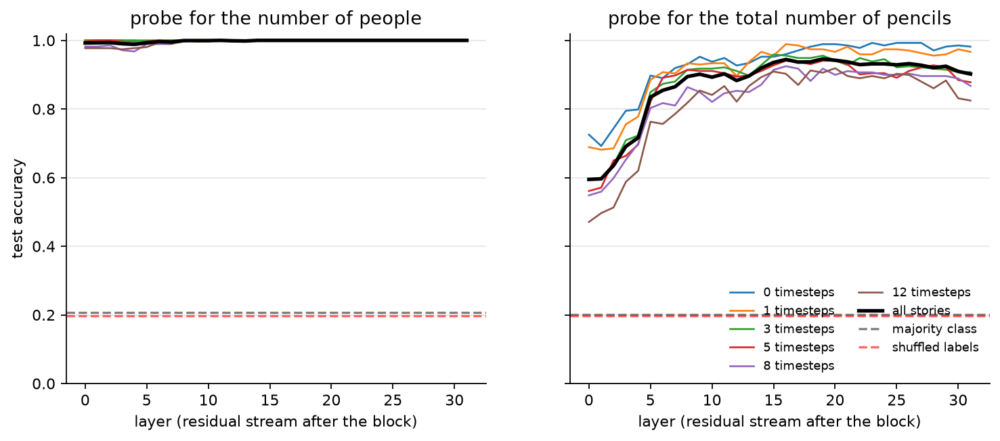
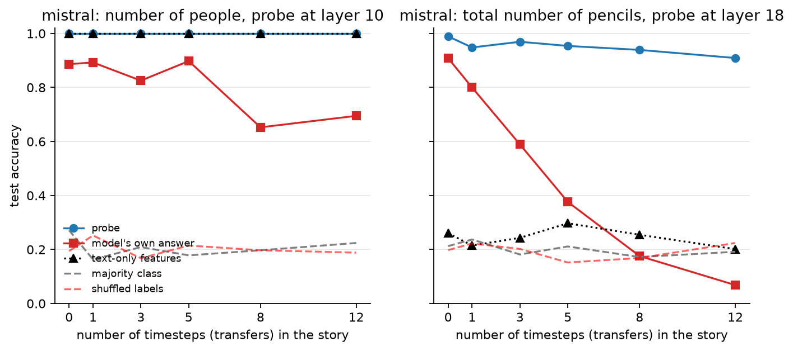
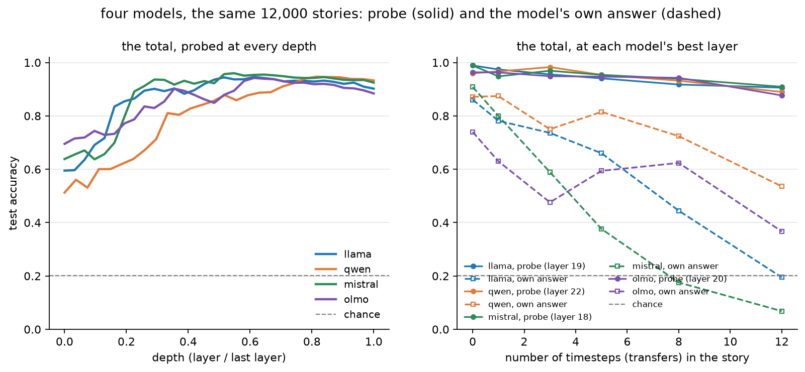
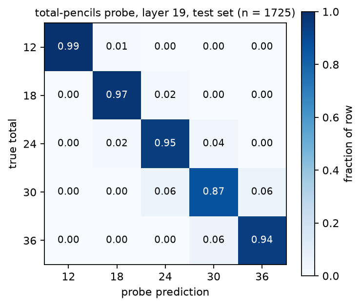

# Can a language model hold a number it never wrote down?

**pencil_counts — probing four open 7–8B instruction-tuned models.**
Harshith Matta · September 2026

## The question

In our stories, several people hold pencils and pass them to one another. The
story never says how many people are taking part, and never says how many pencils
there are in total. The total is a sum: you have to add up the starting amounts
and know that passing pencils around does not change it.

A model can be asked that question directly. If it answers badly, there are two
possible reasons, and they call for very different follow-up work:

1. the model never worked the number out, or
2. the model did work it out internally, but failed to produce it as an answer.

A behavioural test cannot tell these apart. Reading the model's internal state can.

## What we did

We froze each model — no training, no fine-tuning — and pushed 12,000 stories
through it once. At the exact token where the model is about to write its answer,
we recorded the residual stream at every layer. Then we trained a plain linear
classifier ("a probe") on those recorded vectors to predict the two numbers, and
compared it with what the model itself answered to the same prompt.

A story looks like this:

> The following people are participating in the pencil exchange: Harriet, Nadia,
> Bartholomew, Valentina, Desmond and Oleg. At timestep 0, their initial pencil
> holdings are as follows: Harriet holds one pencil, Nadia holds 2 pencils,
> Bartholomew holds one pencil, Valentina holds 7 pencils, Desmond holds 2
> pencils and Oleg holds 5 pencils. At timestep 1, Nadia let Harriet have 1
> pencil. … At timestep 8, Desmond donated four pencils to Harriet.
>
> **Question:** How many pencils are there in total?
> **Answer:**

The answers here are 6 people and 18 pencils. Neither number appears anywhere in
the text, in digits or in words. Stories vary in three ways: 5–9 people, a total
of 12/18/24/30/36 pencils, and 0/1/3/5/8/12 transfers. Each model sees exactly
the same 12,000 stories, so any difference between models is about the models.
The probe is trained on 70 % of the stories and every number quoted below is
measured on the 15 % it never saw.

**Four models:** Llama-3.1-8B-Instruct, Qwen2.5-7B-Instruct, Mistral-7B-Instruct-v0.3,
OLMo-2-1124-7B-Instruct.

**Three baselines**, so that "the probe works" cannot be an illusion:

| baseline | what it rules out |
|---|---|
| majority class (≈ 0.20) | the probe is just guessing the commonest answer |
| shuffled labels | the probe is fitting noise in 4,096 dimensions |
| **text-only** | the answer is readable from the surface of the text — length, number of sentences, how many names appear, how many numbers appear — without the model at all |

The text-only baseline is the important one. It scores a **perfect 1.000 on the
people question**: you can count people by counting names, so that question is
only a check that our pipeline works. It scores **0.18–0.25 on the total**, at
chance, because no surface feature of the text encodes a sum. The total is
therefore the real experiment.

## Results

Test accuracy, 1,725 unseen stories per model. Chance is 0.20.

| model | **total: probe** | total: the model itself | people: probe | people: the model |
|---|---|---|---|---|
| Llama-3.1-8B | **0.946** | 0.606 | 0.999 | 1.000 |
| Qwen2.5-7B | **0.947** | 0.758 | 1.000 | 0.848 |
| Mistral-7B-v0.3 | **0.951** | 0.475 | 1.000 | 0.807 |
| OLMo-2-7B | **0.939** | 0.567 | 0.999 | 0.503 |

**The total is present in all four models, at around 95 % accuracy, while the
models themselves answer it correctly only 48–76 % of the time.** The four probes
agree with each other to within 0.012; the models' own answers spread over 0.28.
The internal representation is far more uniform than the visible behaviour.

### Where in the network the sum appears

*Llama; the other three models look the same in shape.* The left panel is the
people count — solved immediately, as expected. The right panel is the total: it
starts at 0.51–0.70 in the early layers and rises to 0.94–0.96 by roughly
two-thirds of the way through the network, then flattens. The model is not
reading the total off the input; it is computing it, over the first half of its
depth.

### The gap grows with the length of the story

*Mistral, the most extreme case.* The probe (blue) is almost flat: 0.99 with no
transfers, 0.91 after twelve. Mistral's own answer (red) collapses from 0.91 to
0.07 — worse than guessing. The same pattern holds for all four: Llama 0.86 →
0.20, OLMo 0.74 → 0.37, Qwen 0.87 → 0.54. **Longer stories do not destroy the
model's internal estimate of the total; they destroy its ability to report it.**

*All four together.* Left: the total probe against relative depth — four curves
that start apart and converge into one band. Right: each model's probe (solid,
bunched near 0.9) beside its own answer (dashed, fanning apart).

### The mistakes are near-misses

The probe gets 85–105 of 1,725 wrong, and almost every error is one step away on
the 12/18/24/30/36 scale. The internal quantity behaves like an approximate
magnitude, not a lookup table. The models' own errors are larger and one-sided:
Llama, Mistral and Qwen over-estimate the total (73–90 % of their errors), OLMo
under-estimates.

## What this means

For the state-tracking question that motivates the thesis, the answer to "did the
model work it out?" is **yes, largely** — and the failure we see in its answers is
mostly a failure to *use* what it has, not a failure to compute it. That points
the next phase at the readout path (which heads and layers move this quantity to
the answer position, and why longer stories disrupt it) rather than at the
arithmetic itself.

One honest caveat, which belongs in any write-up of this result: *the probe is
trained on thousands of examples while the model answers zero-shot, so the claim
is that the quantity is linearly decodable at the answer position, not that the
model "knows but won't say".* A probe reading 95 % from a representation shows the
information is there and linearly available; it does not prove the model's own
machinery uses that same direction.

A smaller observation worth recording: asked for the total, Llama never begins
with a number — its first token is "To" (*To find the total…*) on 100 % of
prompts, while OLMo answers with a digit every time, Qwen on 92 % and Mistral on
76 %. Reasoning out loud is a habit of one model, not a property of the task. To
compare like with like, every model's answer is scored as the candidate total
(12/18/24/30/36) it assigns the highest probability.

## Limits and what comes next

- Five possible totals and five possible people-counts; a wider range would test
  whether the representation is genuinely numeric or a five-way classification.
- One reading position (the final token) and a linear probe only. A quantity that
  is present non-linearly, or held elsewhere, would look absent here.
- The obvious next experiment is causal rather than correlational: intervene on
  the direction the probe finds and see whether the model's answer moves with it.

## Reproducing

Everything runs from one script per model (`MODEL=qwen bash run.sh`): generate the
stories, check them, extract activations on one GPU, train the probes, draw the
figures. About 1–1.5 hours per model; 8 data-integrity tests guard the stories
(conservation of pencils, one transfer per timestep, and that neither answer ever
appears in the text). Figures for every model are in `results/<model>/figures/`.
