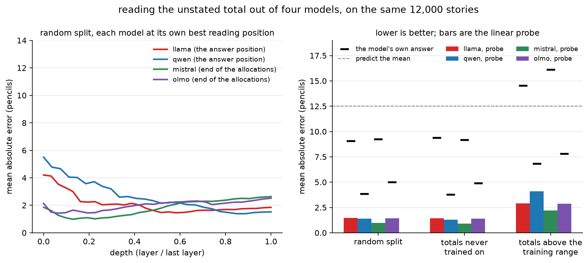
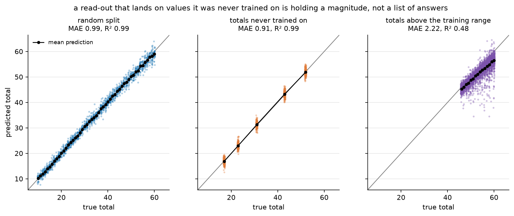
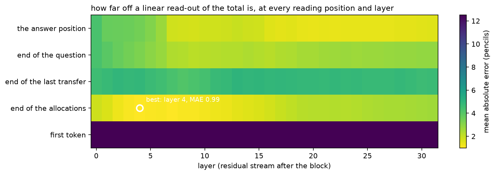
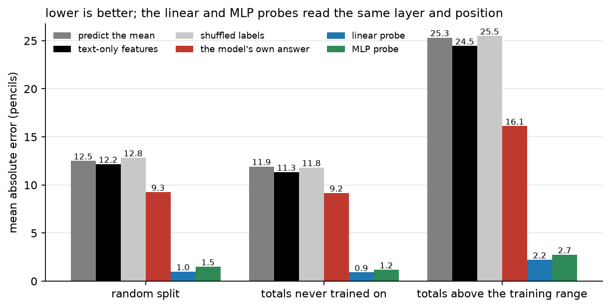

# A number, computed early, and mostly not used

**pencil_scale — how the unstated total is represented in four 7–8B models.**
Harshith Matta · September 2026

## Why this experiment exists

The previous experiment (`pencil_counts`) found that the total number of pencils in
a story — a sum the text never states — can be read out of a frozen model's
residual stream by a linear probe at ~95 % accuracy, in models that answer the same
question correctly only 48–76 % of the time. Two objections to that result were
fair, and this experiment is built to answer them.

1. **It might not have been a number.** There were only five possible totals
   (12, 18, 24, 30, 36), so a probe could have learned five regions of activation
   space rather than a quantity.
2. **It might have been elsewhere, or non-linear.** We read one token — the one
   where the model is about to answer — with a linear probe. Anything held at a
   different position, or non-linearly, would have looked absent.

## What we changed

**The answer became continuous.** The total is now any integer from 10 to 60, and
the read-out is **ridge regression** scored by mean absolute error (MAE, in
pencils), not a classifier scored by accuracy. Chance — predicting the mean total —
is 12.5 pencils of error.

**Three splits, not one.** The split is what turns "can it read the total" into
"is the total a number":

| protocol | trained on | tested on | what it decides |
|---|---|---|---|
| `random` | 70 % of stories | 1,725 held-out stories | how well the total can be read at all |
| `heldout` | every story whose total is not 17, 23, 31, 43 or 52 | 1,186 stories with exactly those totals | does it **interpolate** to values never trained on? |
| `extrapolate` | totals ≤ 45 | 3,515 stories with totals 46–60 | does the magnitude axis continue past the training range? |

A five-way classifier has no output for a value it never saw. A linear direction
that encodes magnitude does.

**Five reading positions × every layer.** The residual stream is cached at the
first token (a control that should carry nothing), the end of the initial-holdings
sentence, the end of the last transfer, the end of the question, and the answer
token. Positions are located through the tokenizer's character-offset map, so each
lands on the sentence it names. At the best cell of each protocol an **MLP**
(one hidden layer, 256 units) is fitted beside the ridge probe.

Everything else is unchanged from `pencil_counts`: same story wording, 5–9 people,
one transfer per timestep, 0/1/3/5/8/12 timesteps, 12,000 stories, and all four
models — Llama-3.1-8B-Instruct, Qwen2.5-7B-Instruct, Mistral-7B-Instruct-v0.3,
OLMo-2-1124-7B-Instruct — see exactly the same stories.

## Results

Probe MAE in pencils at each model's best cell. Chance is 12.5 (25.3 for
extrapolation, where the test totals are all large). The text-only and
shuffled-label controls sit on chance throughout, so nothing here is readable from
the surface of the text.

| model | random | held-out totals | extrapolate | best cell (random) | the model's own answer |
|---|---|---|---|---|---|
| Llama-3.1-8B | 1.46 | 1.44 | 2.90 | answer, L18 | 9.07 |
| Qwen2.5-7B | 1.39 | 1.29 | 4.09 | answer, L23 | 3.86 |
| **Mistral-7B-v0.3** | **0.99** | **0.91** | **2.22** | allocation_end, L4 | 9.26 |
| OLMo-2-7B | 1.42 | 1.38 | 2.86 | allocation_end, L2 | 5.02 |

*Left: error against relative depth, each model at its own best position. Right:
every protocol; bars are the linear probe, black ticks are the model's own answer,
the dashed line is chance.*

### 1. It is a number

*Mistral. Left: ordinary held-out stories. Middle: the five totals the probe was
never trained on. Right: totals above the entire training range.*

The middle panel is the decisive one. On totals **excluded from training
altogether**, the probe's mean predictions are 17 → 16.9, 23 → 23.0, 31 → 31.3,
43 → 43.3, 52 → 51.9, at an MAE of 0.91 — *better* than on ordinary held-out
stories (0.99). All four models show the same pattern; in every one of them the
held-out-value error is equal to or lower than the random-split error. A model
that had memorised a set of answer regions could not place a value it had never
been trained to produce.

Extrapolation beyond the training range (right panel) is weaker but instructive:
predictions keep rising with the true total — correlation 0.69–0.84 across the four
models — at a **compressed slope of 0.60–0.81** instead of 1. The direction is real
and continues past where it was fitted; the scale flattens at the top. That is the
signature of a magnitude encoded over a bounded range, not of a lookup table (which
would predict a flat line) and not of a perfect number line (which would predict
slope 1).

### 2. It is computed early, and not only at the answer

Best MAE at each position, random split:

| model | first token | end of allocations | end of last transfer | end of question | answer |
|---|---|---|---|---|---|
| Llama | 12.51 | 1.57 (L1) | 5.51 | 2.29 | **1.46** (L18) |
| Qwen | 12.49 | 1.91 (L9) | 5.50 | 2.47 | **1.39** (L23) |
| Mistral | 12.51 | **0.99** (L4) | 4.11 | 2.18 | 1.38 (L20) |
| OLMo | 12.51 | **1.42** (L2) | 5.49 | 2.12 | **1.46** (L19) |

Three things follow.

- **The control behaves.** At the first token the error is exactly chance in all
  four models, so the pipeline is not leaking the answer through position
  bookkeeping.
- **The sum exists before the story is over.** At the end of the initial-holdings
  sentence — before a single transfer has been narrated — the total is already
  readable to within 1.0–1.9 pencils, and in Mistral and OLMo that is the *best*
  cell anywhere, at **layers 4 and 2**. The model adds the starting amounts almost
  immediately on reading them, then carries the result forward. `pencil_counts` was
  reading the end of that pipeline, not its source.
- **The middle of the story is the worst place to look.** At the end of the last
  transfer the error is 4.1–5.5 for every model — three to five times worse than a
  few tokens earlier or later. Whatever is happening at the transfer sentences
  disturbs the quantity locally; it is recovered by the question and answer tokens.

Mistral's error by layer at the allocations makes the shape plain: 1.86 at layer 0,
**0.99 at layer 4**, then a slow decay back to 2.49 by layer 28 — the total is
built in the first few blocks and slowly dissipates, rather than accumulating with
depth.

### 3. Linearity was not hiding anything

The MLP loses to ridge in 10 of the 12 (model × protocol) cells and ties in the
other 2 — for example Mistral 1.50 vs 0.99 on the random split, OLMo 2.16 vs 1.42.
With 8,400 training examples a non-linear read-out has every opportunity to find
structure the linear one misses, and it does not. The linear reading in
`pencil_counts` was not an artefact of the probe's simplicity.

### 4. What a model holds and what it says are unrelated

The four models' internal read-outs span 0.99–1.46 MAE — a range of half a pencil.
Their own answers span 3.86–9.26, a range of five and a half. And the ordering is
not shared: **Mistral has the best representation (0.99) and nearly the worst
answers (9.26); Qwen has a middling representation (1.39) and by far the best
answers (3.86).**

The models also degrade differently with story length. Mistral's own error grows
from 2.5 pencils with no transfers to 23.0 after twelve; Qwen's grows only from 3.3
to 7.9. The probe, meanwhile, stays near 1 pencil throughout. Whatever separates
these models is in the path from the representation to the output, not in the
arithmetic.

## What this establishes

- The quantity `pencil_counts` found is a **numeric magnitude**, linearly encoded,
  that generalises to values never used in training and degrades gracefully
  (compressed, not broken) outside the trained range.
- It is **not** localised to the answer position: it appears within the first few
  layers at the end of the allocations, in two of four models more cleanly than
  anywhere else.
- It is **not** hidden by linearity: an MLP finds nothing extra.
- The variation between models is in the **read-out**, not the computation — which
  is where the next experiment should intervene.

The caveat from the earlier report still applies and is worth repeating verbatim:
*the probe is trained on thousands of examples while the model answers zero-shot,
so the claim is that a quantity is linearly decodable at the answer position, not
that the model "knows but won't say".* This experiment strengthens the claim's
content — the decodable thing is a number, present early and in more than one place
— without changing its logical status.

## Limits and next steps

- Totals span 10–60 with 5–9 people. Larger ranges and more people would test
  whether the compressed extrapolation slope is a property of the representation or
  of our range.
- The read-out is correlational. The decisive follow-up is **causal**: add a
  multiple of the fitted direction at the end of the allocations and see whether
  the model's answer moves by the predicted amount. The layer-2-to-4 result makes
  this cheap to try, since the intervention point is early and well localised.
- The "worst position is the last transfer" finding deserves its own look: it is
  the only place where the quantity measurably degrades, and it is exactly where
  state tracking is doing work.

## Reproducing

One command per model (`MODEL=mistral bash run.sh`): generate, check, extract on one
GPU, probe, draw. 43 minutes for OLMo to 2 h 22 m for Mistral — Qwen and Mistral are
slower only because they write two-digit totals as two tokens, which costs extra
forward passes when scoring the model's own answer. Per-model figures are in
`results/<model>/figures/`, the comparison in `results/figures/`, and the numbers
behind every table in `results/summary_all_models.csv`.
