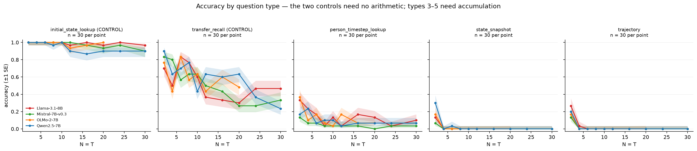
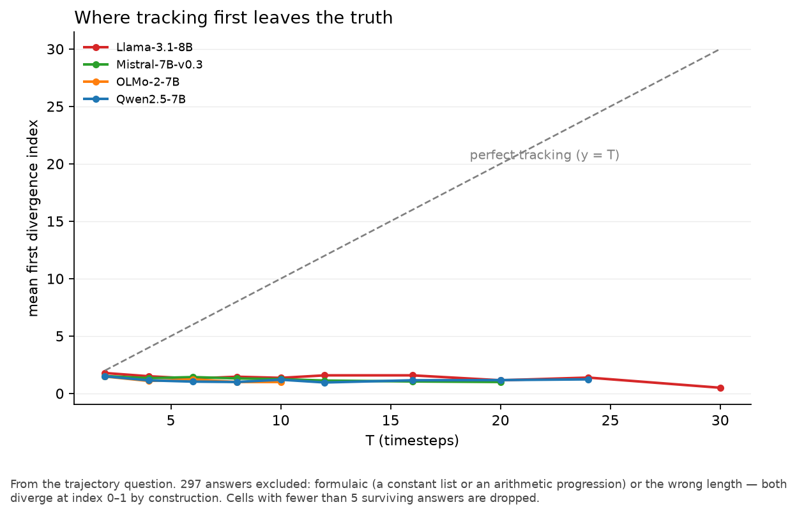

# pencil_taxonomy

A self-contained behavioral evaluation of four open instruction-tuned models on a
synthetic state-tracking task: `N` people pass pencils over `T` timesteps, and the
model answers questions about who holds what. Across **6,000 generations** the
result is a clean dissociation — retrieval survives, accumulation does not. A
question answerable by copying a number written in the text is answered correctly
**97%** of the time; asking for that same number after **one** update drops to
**10%**; whole-vector questions are at the floor from N=4. Every wrong answer is
then classified by replaying the simulator under one hypothesised corruption, with
a Monte-Carlo chance null, so each category is reported as `observed − chance`
rather than as a raw rate.



The ladder above is the core result: question types ordered by how much
accumulation they need, and accuracy falls monotonically with that ordering in all
four models.



Tracking does not decay gradually — it fails at the first update. The mean first
divergence index stays flat and low at every `T`, far below the `y = T`
perfect-tracking reference.

**[REPORT.md](REPORT.md) is the full write-up** — the task, the question ladder,
the taxonomy with its chance null, the hypotheses, validity checks and
limitations.

## Scale

| | |
|---|---|
| models | Qwen2.5-7B, Llama-3.1-8B, Mistral-7B-v0.3, OLMo-2-7B |
| grid | `N = T` ∈ {2,4,6,8,10,12,16,20,24,30}, 30 stories each |
| questions | 5 types × 300 stories = 1,500 per model |
| generations | **6,000** |

## How to run

`config.yaml` holds every number the experiment depends on — the grid, seeds,
model list, sampling parameters and `max_tokens` rules. Nothing is hardcoded
elsewhere.

```bash
python -m venv envs/eval && envs/eval/bin/pip install -r requirements.txt
source envs/eval/bin/activate
mkdir -p logs                                  # Slurm opens log files before the job runs

python -m src.check_models                     # weights present at local_path?
python -m src.generate_stories                 # 300 stories, seeded from config
python -m src.generate_questions               # 1,500 questions + ground truth
python -m src.smoke --model qwen               # MANDATORY gate -- read the output
sbatch scripts/run_model.sbatch qwen           # one job per model
python -m src.regrade   --run-dir results/raw/<run_id>
python -m src.aggregate --run-dir results/raw/<run_id>_regraded
python -m src.plots
python -m pytest -q
```

Everything after the sweep runs without a GPU: each graded field is reconstructible
from the stored `raw_output`, so fixing a grading bug takes seconds instead of
another allocation.

### Adding another model

One edit, then one command:

1. Append an entry to `models:` in `config.yaml` — `key`, `hf_id`, `local_path`,
   `max_context`, and `use_system_role` (`false` if the model's chat template
   rejects a system turn, as Mistral-v0.3's does). The comment block at the top of
   `config.yaml` gives the exact shape.
2. Copy the weights to `local_path` first — compute nodes are air-gapped and
   nothing here downloads anything.

```bash
mkdir -p logs
sbatch scripts/run_model.sbatch <key>
python -m src.aggregate && python -m src.plots
```

The new model is directly comparable with the four already run: it reuses the same
grid, seeds and the frozen templates in `prompts/`, and every record stores their
`template_sha256` alongside `prompt_sha256` — which is what lets a later run
*prove* it used the same prompts rather than merely assert it.

## Layout

```
config.yaml        grid, models, seeds, generation settings -- every number
prompts/           5 frozen templates (hashed into every record)
src/generator.py   COPIED VERBATIM from the source project; provenance in header
src/questions.py   the 5 types + ground truths
src/parsing.py     lenient parser + normalise()
src/taxonomy.py    5 categories + Monte-Carlo chance null
results/figures/   committed
results/tables/    committed
```

`models/`, `envs/`, `data/`, `logs/`, `results/raw/` and `results/smoke/` are
git-ignored — all of them regenerable from the seeds in `config.yaml`. The
directory has no path or import dependency on any sibling directory.
